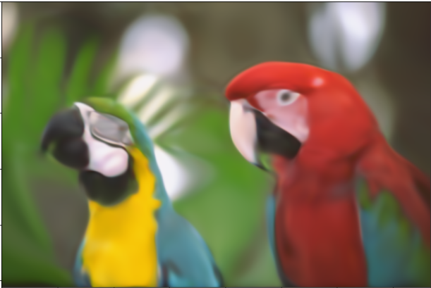

# Toying with COIN

We took about 6 hours to implement COIN (compression with implicit neural representation) from the [paper](https://arxiv.org/abs/2103.03123).
We only trained on a CPU, and where using this opportunity to familiarize ourselves with Palladium.

## Results
| Original | Decompressed (50 Epochs) |
| --- | --- |
|  | |

## Team
[Gert-Jan Dobbelaere](https://www.linkedin.com/in/gert-jan-dobbelaere/), [Sascha Gerloff](https://www.linkedin.com/in/sascha-gerloff-a853581b7/), [Sergio Vechi](https://www.linkedin.com/in/sergiovechi/)  
